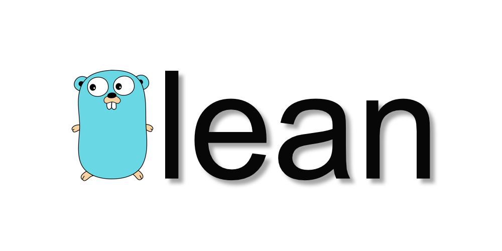

`glean` helps you remove files corresponding to removed _reference_ files.


## A simple usage case

I take photos in both JPEG and RAW formats and my typical workflow looks like follows:

1. review photos in JPEG (because it's much faster than cycling through RAW files)
2. remove all bad photos in JPEG which I don't like
3. then remove corresponding RAW files

The third step is a bit annoying to do manually, so I built `glean` to do this for me automatically.

With `glean` the same workflow looks like follows:

1. create a configuration file for `glean` (only once)
2. remove all bad photos in JPEG
3. run `glean` and it will automatically remove all corresponding RAW files

## Configuration

In order to minimize chances of accidentally removing valuable files, `glean` requires you to create a configuration file.

If you run `glean` from a directory which has a file called `glean.yaml`, it will automatically use this file as a configuration.

Otherwise, you have to tell it where to look for this file like follows:
`glean --config=../relative/path/to/glean.conf`

### Configuration Syntax

`glean` expects configuration files to be in [YAML](https://en.wikipedia.org/wiki/YAML) format.

A configuration file should look like this:

```
---
ref_dir: . # should be relative to a directory from where you run `glean`. `.` means "current directory"
ref_ext:
    - .jpeg
    - .jpg

target_dir: . # should be relative to a directory from where you run `glean`. `.` means "current directory"
target_ext:
    - .nef
    - .raw
    - .dng
```

`ref_dir` - where are your reference files located  
`ref_ext` - a list of "reference" file extensions  

`target_dir` - where to look for corresponding files to be removed  
`target_ext` - a list of extensions of the corresponding files  

# WARNING

`glean` does not ask for confirmations and it does not put anything into your "Trash".
If you made a mistake and it removed pictures of your 1 yo old daughter, please don't be upset with me.


## License

glean is an open-source software and licensed under the MIT License.
